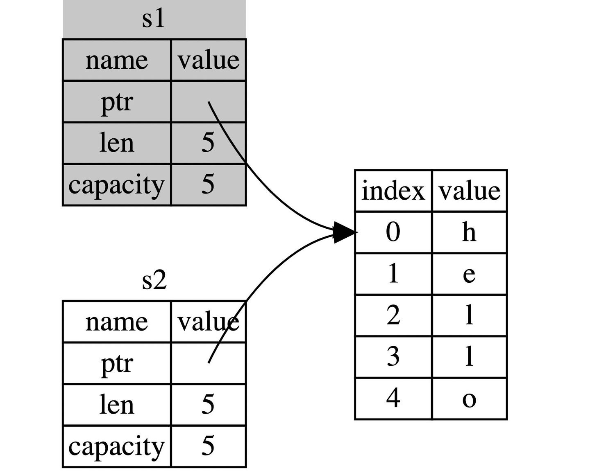

Rust 中每一个值都被一个变量所拥有，该变量被称为值的所有者
一个值同时只能被一个变量所拥有，或者说一个值只能拥有一个所有者
当所有者(变量)离开作用域范围时，这个值将被丢弃(drop)

如果你在其他语言中听说过术语 浅拷贝(shallow copy) 和 深拷贝(deep copy)，
那么拷贝指针、长度和容量而不拷贝数据听起来就像浅拷贝，但是又因为 Rust 同时使第一个变量 s1 无效了，
因此这个操作被称为 移动(move)，而不是浅拷贝。上面的例子可以解读为 s1 被移动到了 s2 中。那么具体发生了什么，用一张图简单说明：

s1 moved to s2
这样就解决了我们之前的问题，s1 不再指向任何数据，只有 s2 是有效的，当 s2 离开作用域，它就会释放内存.

Rust 有一个叫做 Copy 的特征，可以用在类似整型这样在栈中存储的类型。如果一个类型拥有 Copy 特征，一个旧的变量在被赋值给其他变量后仍然可用。

那么什么类型是可 Copy 的呢？可以查看给定类型的文档来确认，不过作为一个通用的规则： 任何基本类型的组合可以 Copy ，不需要分配内存或某种形式资源的类型是可以 Copy 的。如下是一些 Copy 的类型：

所有整数类型，比如 u32
布尔类型，bool，它的值是 true 和 false
所有浮点数类型，比如 f64
字符类型，char
元组，当且仅当其包含的类型也都是 Copy 的时候。比如，(i32, i32) 是 Copy 的，但 (i32, String) 就不是
不可变引用 &T ，例如转移所有权中的最后一个例子，但是注意: 可变引用 &mut T 是不可以 Copy的
