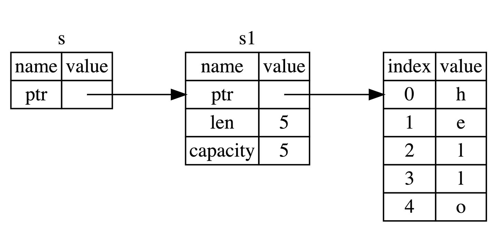

不可变引用
下面的代码，我们用 s1 的引用作为参数传递给 calculate_length 函数，而不是把 s1 的所有权转移给该函数：

```
fn main() {
let s1 = String::from("hello");

    let len = calculate_length(&s1);

    println!("The length of '{}' is {}.", s1, len);
}

fn calculate_length(s: &String) -> usize {
s.len()
}
```
能注意到两点：

无需像上章一样：先通过函数参数传入所有权，然后再通过函数返回来传出所有权，代码更加简洁
calculate_length 的参数 s 类型从 String 变为 &String
这里，& 符号即是引用，它们允许你使用值，但是不获取所有权，如图所示：


借用规则如下
> 同一时刻，你只能拥有要么一个可变引用, 要么任意多个不可变引用    
引用必须总是有效的
> 
> 
> 获取变量的引用，称之为借用(borrowing)