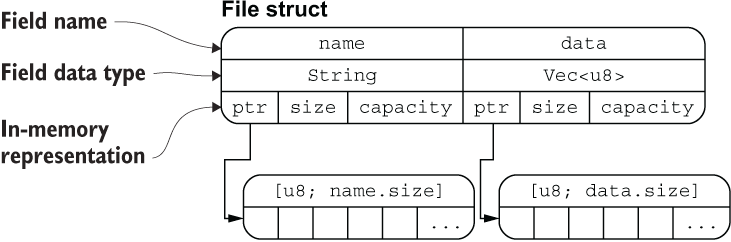

创建结构体实例
为了使用上述结构体，我们需要创建 User 结构体的实例：

    let user1 = User {
        email: String::from("someone@example.com"),
        username: String::from("someusername123"),
        active: true,
        sign_in_count: 1,
    };
有几点值得注意:

> 初始化实例时，每个字段都需要进行初始化
初始化时的字段顺序不需要和结构体定义时的顺序一致

>  需要注意的是，必须要将结构体实例声明为可变的，才能修改其中的字段，Rust 不支持将某个结构体某个字段标记为可变。
```rust
    let mut user1 = User {
        email: String::from("someone@example.com"),
        username: String::from("someusername123"),
        active: true,
        sign_in_count: 1,
    };

    user1.email = String::from("anotheremail@example.com");

```

## 结构体的内存排餐
```rust
#[derive(Debug)]
 struct File {
   name: String,
   data: Vec<u8>,
 }

 fn main() {
   let f1 = File {
     name: String::from("f1.txt"),
     data: Vec::new(),
   };

   let f1_name = &f1.name;
   let f1_length = &f1.data.len();

   println!("{:?}", f1);
   println!("{} is {} bytes long", f1_name, f1_length);
 }
```

从图中可以清晰地看出 File 结构体两个字段 name 和 data 分别拥有底层两个 [u8] 数组的所有权(String 类型的底层也是 [u8] 数组)，通过 ptr 指针指向底层数组的内存地址，这里你可以把 ptr 指针理解为 Rust 中的引用类型。

该图片也侧面印证了：把结构体中具有所有权的字段转移出去后，将无法再访问该字段，但是可以正常访问其它的字段。

## 元组结构体(Tuple Struct)
结构体必须要有名称，但是结构体的字段可以没有名称，这种结构体长得很像元组，因此被称为元组结构体，例如：
```rust
    struct Color(i32, i32, i32);
    struct Point(i32, i32, i32);

    let black = Color(0, 0, 0);
    let origin = Point(0, 0, 0);
```
元组结构体在你希望有一个整体名称，但是又不关心里面字段的名称时将非常有用。例如上面的 Point 元组结构体，众所周知 3D 点是 (x, y, z) 形式的坐标点，因此我们无需再为内部的字段逐一命名为：x, y, z。

## 单元结构体(Unit-like Struct)
还记得之前讲过的基本没啥用的单元类型吧？单元结构体就跟它很像，没有任何字段和属性，但是好在，它还挺有用。

如果你定义一个类型，但是不关心该类型的内容, 只关心它的行为时，就可以使用 单元结构体：
```rust
struct AlwaysEqual;

let subject = AlwaysEqual;

// 我们不关心 AlwaysEqual 的字段数据，只关心它的行为，因此将它声明为单元结构体，然后再为它实现某个特征
impl SomeTrait for AlwaysEqual {

}

```
