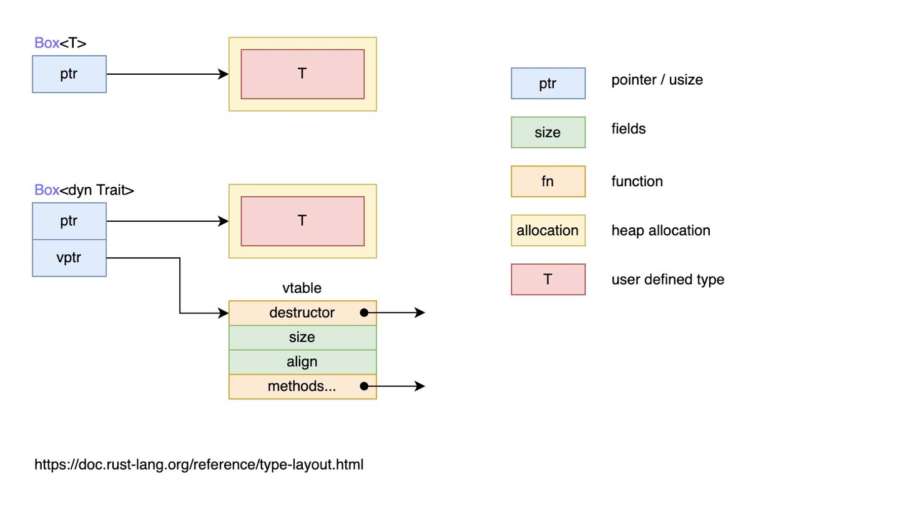

```rust
pub struct Button {
    pub width: u32,
    pub height: u32,
    pub label: String,
}

impl Draw for Button {
    fn draw(&self) {
        // 绘制按钮的代码
    }
}

struct SelectBox {
    width: u32,
    height: u32,
    options: Vec<String>,
}

impl Draw for SelectBox {
    fn draw(&self) {
        // 绘制SelectBox的代码
    }
}

// 此时，还需要一个动态数组来存储这些 UI 对象：

pub struct Screen {
    pub components: Vec< ? >,
}
```

注意到上面代码中的 ? 吗？它的意思是：我们应该填入什么类型，可以说就之前学过的内容里，你找不到哪个类型可以填入这里，但是因为
Button 和 SelectBox 都实现了 Draw 特征，那我们是不是可以把 Draw 特征的对象作为类型，填入到数组中呢？答案是肯定的。
`特征对象`指向实现了 Draw 特征的类型的实例，也就是指向了 Button 或者 SelectBox 的实例，这种映射关系是存储在一张表中，可以在运行时通过特征对象找到具体调用的类型方法。
可以通过 & 引用或者 Box<T> 智能指针的方式来创建特征对象。

## 特征对象的动态分发

回忆一下泛型章节我们提到过的，泛型是在编译期完成处理的：编译器会为每一个泛型参数对应的具体类型生成一份代码，这种方式是静态分发(
static dispatch)，因为是在编译期完成的，对于运行期性能完全没有任何影响。
与静态分发相对应的是动态分发(dynamic dispatch)，在这种情况下，直到运行时，才能确定需要调用什么方法。之前代码中的关键字 dyn (
dynamic)正是在强调这一“动态”的特点。

当使用特征对象时，Rust 必须使用动态分发。编译器无法知晓所有可能用于特征对象代码的类型，所以它也不知道应该调用哪个类型的哪个方法实现。为此，Rust
在运行时使用特征对象中的指针来知晓需要调用哪个方法。动态分发也阻止编译器有选择的内联方法代码，这会相应的禁用一些优化。

下面这张图很好的解释了静态分发 Box<T> 和动态分发 Box<dyn Trait> 的区别：


结合上文的内容和这张图可以了解：

* 特征对象大小不固定：这是因为，对于特征 Draw，类型 Button 可以实现特征 Draw，类型 SelectBox 也可以实现特征 Draw，因此特征没有固定大小
* 几乎总是使用特征对象的引用方式，如 &dyn Draw、Box<dyn Draw>
    * 虽然特征对象没有固定大小，但它的引用类型的大小是固定的，它由两个指针组成（ptr 和 vptr），因此占用两个指针大小(64位机器，8字节的指针)
    * 一个指针 ptr 指向实现了特征 Draw 的具体类型的实例，也就是当作特征 Draw 来用的类型的实例，比如类型 Button 的实例、类型
      SelectBox 的实例
    * 另一个指针 vptr 指向一个虚表 vtable，vtable 中保存了类型 Button 或类型 SelectBox 的实例对于可以调用的实现于特征
      Draw 的方法。当调用方法时，直接从 vtable 中找到方法并调用。之所以要使用一个 vtable 来保存各实例的方法，是因为实现了特征
      Draw 的类型有多种，这些类型拥有的方法各不相同，当将这些类型的实例都当作特征 Draw 来使用时(此时，它们全都看作是特征
      Draw 类型的实例)，有必要区分这些实例各自有哪些方法可调用

简而言之，当类型 Button 实现了特征 Draw 时，类型 Button 的实例对象 btn 可以当作特征 Draw 的特征对象类型来使用，btn
中保存了作为特征对象的数据指针（指向类型 Button 的实例数据）和行为指针（指向 vtable）。

一定要注意，此时的 btn 是 Draw 的特征对象的实例，而不再是具体类型 Button 的实例，而且 btn 的 vtable 只包含了实现自特征 Draw
的那些方法（比如 draw），因此 btn 只能调用实现于特征 Draw 的 draw 方法，而不能调用类型 Button 本身实现的方法和类型 Button
实现于其他特征的方法。也就是说，**btn 是哪个特征对象的实例**，它的 `vtable` 中就包含了该特征的方法。

Self 与 self
在 Rust 中，有两个self，一个指代当前的实例对象，一个指代特征或者方法类型的别名：

```rust
trait Draw {
    fn draw(&self) -> Self;
}

#[derive(Clone)]
struct Button;

impl Draw for Button {
    fn draw(&self) -> Self {
        return self.clone();
    }
}

fn main() {
    let button = Button;
    let newb = button.draw();
}
```

上述代码中，self指代的就是当前的实例对象，也就是 button.draw() 中的 button 实例，Self 则指代的是 Button 类型。

当理解了 self 与 Self 的区别后，我们再来看看何为对象安全。

## 特征对象的限制

不是所有特征都能拥有特征对象，只有对象安全的特征才行。当一个特征的所有方法都有如下属性时，它的对象才是安全的：

方法的返回类型不能是 Self
方法没有任何泛型参数
对象安全对于特征对象是必须的，因为一旦有了特征对象，就不再需要知道实现该特征的具体类型是什么了。如果特征方法返回了具体的
Self 类型，但是特征对象忘记了其真正的类型，那这个 Self
就非常尴尬，因为没人知道它是谁了。但是对于泛型类型参数来说，当使用特征时其会放入具体的类型参数：此具体类型变成了实现该特征的类型的一部分。而当使用特征对象时其具体类型被抹去了，故而无从得知放入泛型参数类型到底是什么。

标准库中的 Clone 特征就不符合对象安全的要求：

```rust
pub trait Clone {
    fn clone(&self) -> Self;
}
```

因为它的其中一个方法，返回了 Self 类型，因此它是对象不安全的。

String 类型实现了 Clone 特征， String 实例上调用 clone 方法时会得到一个 String 实例。类似的，当调用 Vec<T> 实例的 clone
方法会得到一个 Vec<T> 实例。clone 的签名需要知道什么类型会代替 Self，因为这是它的返回值。

如果违反了对象安全的规则，编译器会提示你。例如，如果尝试使用之前的 Screen 结构体来存放实现了 Clone 特征的类型：

```rust
pub struct Screen {
    pub components: Vec<Box<dyn Clone>>,
}
```

将会得到如下错误：

```rust
error[E0038]: the trait `std::clone::Clone` cannot be made into an object
- -> src/lib.rs:2: 5
|
2 | pub components: Vec<Box<dyn Clone>>,
| ^ ^ ^ ^ ^ ^ ^^ ^ ^ ^ ^ ^ ^ ^ ^ ^^ ^ ^ ^ ^ ^ ^ ^ ^ ^ ^ ^ ^ ^ ^ ^ ^ ^ the trait `std::clone::Clone`
cannot be made into an object
|
= note: the trait cannot require that ` Self: Sized`
```

这意味着不能以这种方式使用此特征作为特征对象。